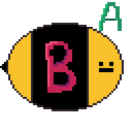
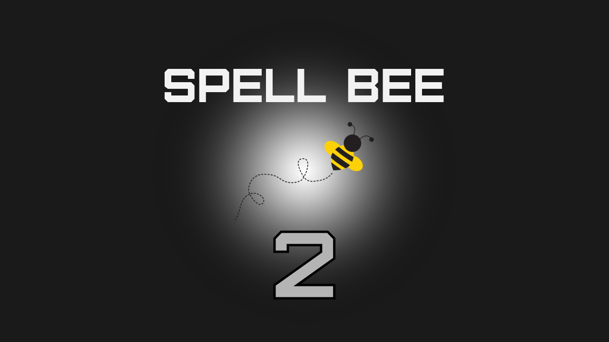

# Spell Bee 2 🐝

Welcome to Spell Bee 2! This is a remake of my previous Spell Bee game. This game is quite different than the first one. In this game, you have to spell 5 randomly chosen words based on the audio. If you guess a word right, you go the next word. If not, you lose a life. You have a total of 3 lives. If all lives are lost, you lose the game. Hope you enjoy!

Made using [Random Word API](https://random-word-api.vercel.app) and [Dictionary API](https://dictionaryapi.dev)

Favicon was inspired from [This Video!]("https://www.youtube.com/watch?v=ohKPqGxotao)

Image Background:

Also, check out my Blog at https://www.sriyansites.mywire.org

Check out my WhatsApp Channel: https://www.whatsapp.com/channel/0029Vb8hmKi6xCSRaR3zhz2G
